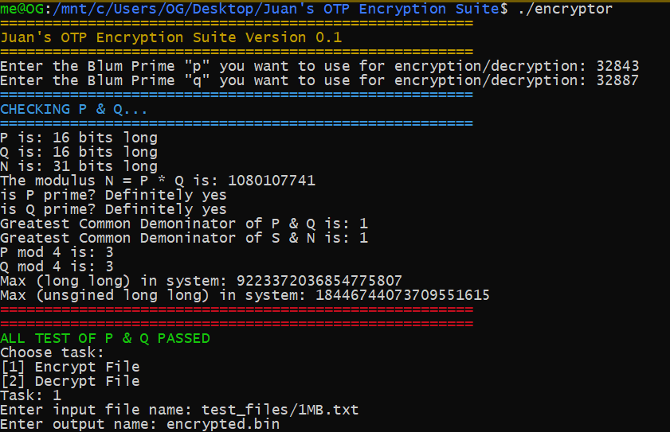
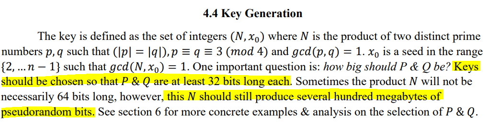

# Juan's-OTP-Encryption-Suite
Encryption software suite using Blum Blum Shub (BBS) pseudo-random number generator 

This is software is an encryption program which can be use to encrypt any kind of file. It uses a custom implementation of Blum Blum Shub (B.B.S.) pseudo-random number generator.
BBS was proposed in 1986 by Lenore Blum, Manuel Blum and Michael Shub in a paper called *A Simple Unpredictable Pseudo-Random Number Generator*

BBS is a cryptographically secure pseudo-random number generator

## How to Compile
```
g++ -O3 main.cpp OTPI.cpp bbs.cpp -std=c++1z -o encryptor -lgmp
```

## Requirements

- C++17
- GNU Multiple Precision Arithmetic Library (The GNU MP Bignum Library)


## Getting Started

In order to use this encryption software you need to chose 3 numbers: P, Q and a seed.

**P and Q are to be large Blum prime numbers.**

A Blum prime number P is a number P congruent to 3 (modulus 4)

- That means: p ≡ 3 (mod 4)

Let N = (P * Q)

The seed should be a number between 1 and N - 1

Once you have those 3 numbers, you can run the executable and input those numbers.

That set of numbers (*P, Q, Seed*) **is your encryption and decryption key.**

Please see [this research paper](docs/"ResearchPaper.pdf") on which this software is based on for a more in-depth description of how the math behind the encryption method used in this software works. 

The program will automatically check your key to make sure it meets the minimum requirements.

### Example (Using 16 bit P & Q numbers)



## How secure is the encryption?

Reading [this research paper](docs/"ResearchPaper.pdf") on which this software is based is *highly encouraged*. Simply put, the encryption mechanism used in this software is effectively a *one-time pad* (OTP) which requires the use of a one-time pre-shared key the same size as, or longer than, the message being sent. In this technique, a plaintext is paired with a random secret key (also referred to as a one-time pad). Then, each bit of the plaintext is encrypted by combining it with the corresponding bit from the pad using modular addition.

The strength of this encryption technique heavily depends on the quality of the OTP generated. This software generates an OTP using the BBS pseudo-random number generator which is cryptographically secure. Optimally, a OTP should be generated using physical methods, rather than software, however, this software aims to be practical and portable, which is why we have opted to use a software-based method to generate random bits.


## How secure is Blum Blum Shub pseudo-random number generator?

This discussion is outside of the scope of this README document. We encourage the reader to seek further understanding of this generator by reading the following recommended papers:

-  Fast Blum-Blum-Shub Sequence Generation Using Montgomery Multiplication (M.G.Parker, A.H.Kemp, S.J.Shepherd)
-  Multiprime Blum-Blum-Shub pseudorandomnumber generator (Shrestha, Bijesh)
-  About Random Bits (Martin Geisler, MikkelKr ̄igÂrd, AndreasDanielsen)
-  Cryptographic Secure Pseudo-Random Bits Generation: The Blum-Blum-Shub Generator (Pascal Junod)
-  Concrete Security of the Blum-Blum-Shub Pseudorandom Generator (Andrey Sidorenko and Berry Schoenmakers)

## Current state of project

There is still a lot of work to be done before this software could be considered *production ready*.

Areas we haven't looked at:

- How large can the to-be-encrypted-files be?
- How to speed up/optimize encryption/decryption time
- Sanity check on the OTP (*i.e. is the OTP large enough for the file to be encrypted?*)

## Recommendations for choosing P & Q
Snippet from [this research paper](docs/"ResearchPaper.pdf")



